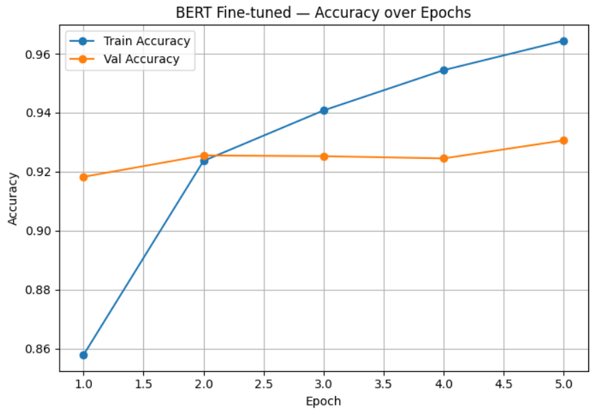
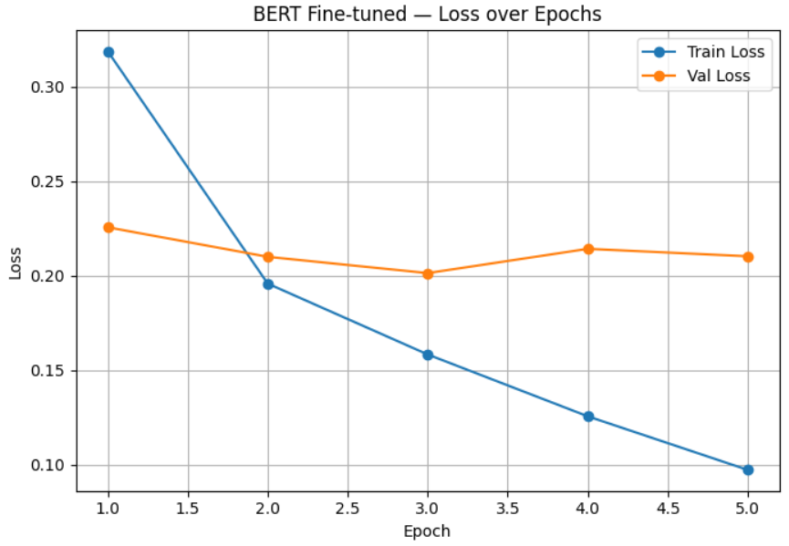

# 🧠 Plagiarism Detection using BERT

A deep learning project for detecting plagiarism between two sentences using a fine-tuned BERT model.

---

## Overview

This model takes two texts as input:

* Original text
* Suspected plagiarized text

Then predicts whether the second text is plagiarized from the first.

---

## 🤖 Model

* Pretrained transformer: `all-MiniLM-L6-v2`
* Fine-tuned using PyTorch
* Architecture:

  * BERT encoder
  * Dropout layer
  * Linear classifier (2 classes)

---

## Training

* Optimizer: AdamW
* Loss Function: CrossEntropyLoss
* Epochs: 5
* Early Stopping applied

---

## 📊 Results

* **Accuracy: 93.06%**

The model shows strong and balanced performance in detecting both plagiarized and non-plagiarized text.

---

## 📈 Training Curves

### Accuracy over Epochs


### Loss over Epochs



---

##  Example

```python
predict_bert(
'The scientists discovered a new species of bird in the rainforest.',
'Researchers found a previously unknown bird species in the jungle.'
)
```

**Output:**

```
Plagiarism probability: 0.9642
✅ PLAGIARIZED
```

---

##  Tech Stack

* Python
* PyTorch
* Transformers (HuggingFace)
* Scikit-learn
* Matplotlib
* Pandas / NumPy

---

## 📌 Key Idea

BERT understands the semantic meaning of both sentences, and a simple classifier decides if they are similar enough to be considered plagiarism.
